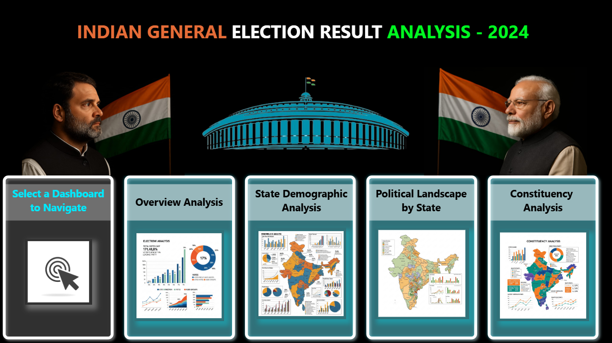
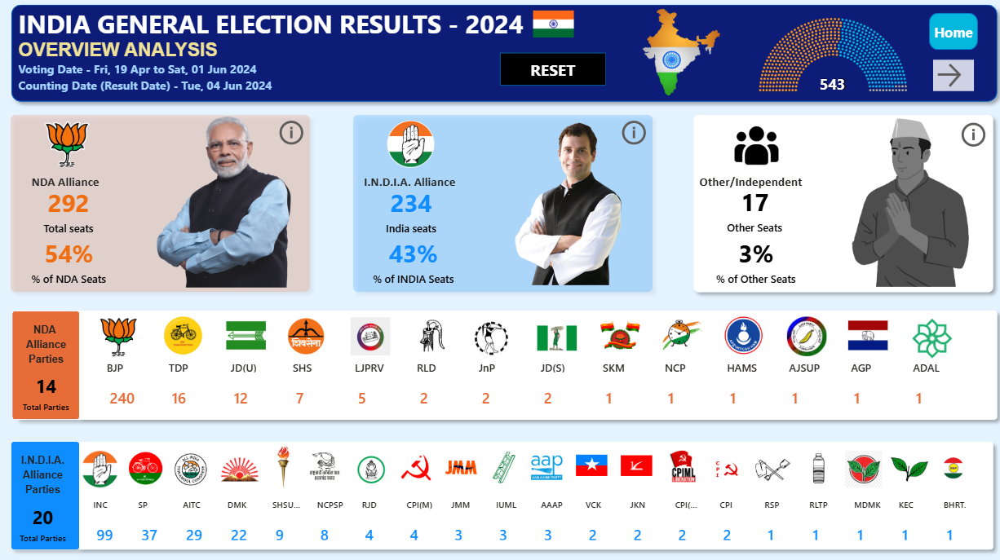
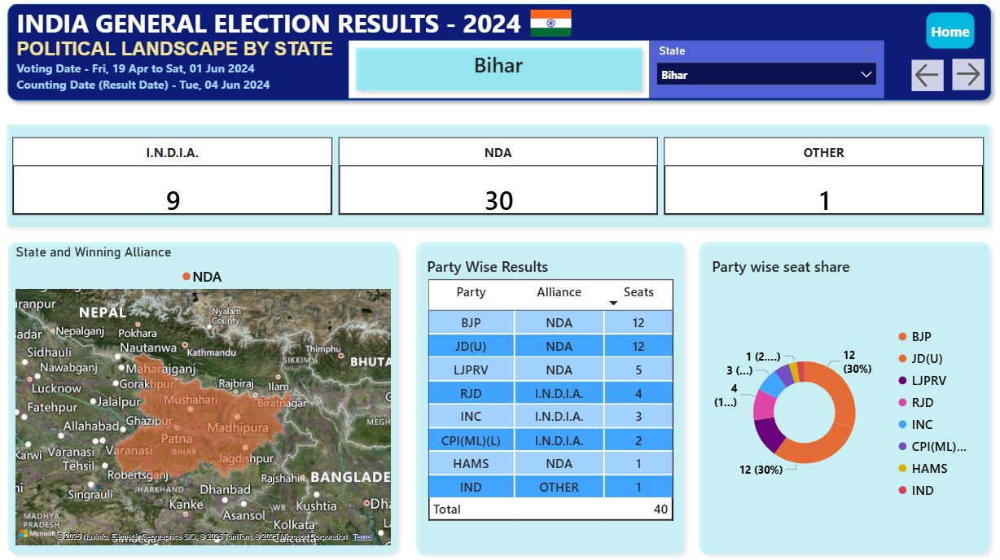
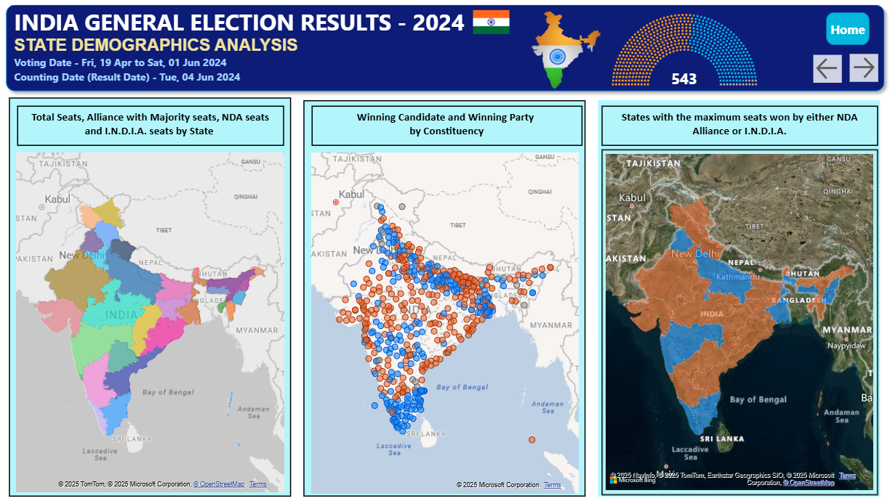
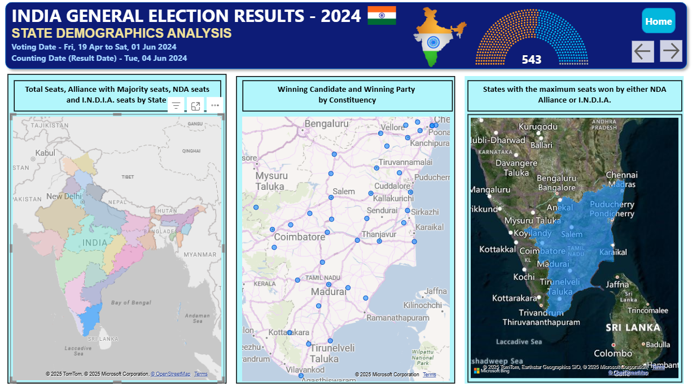
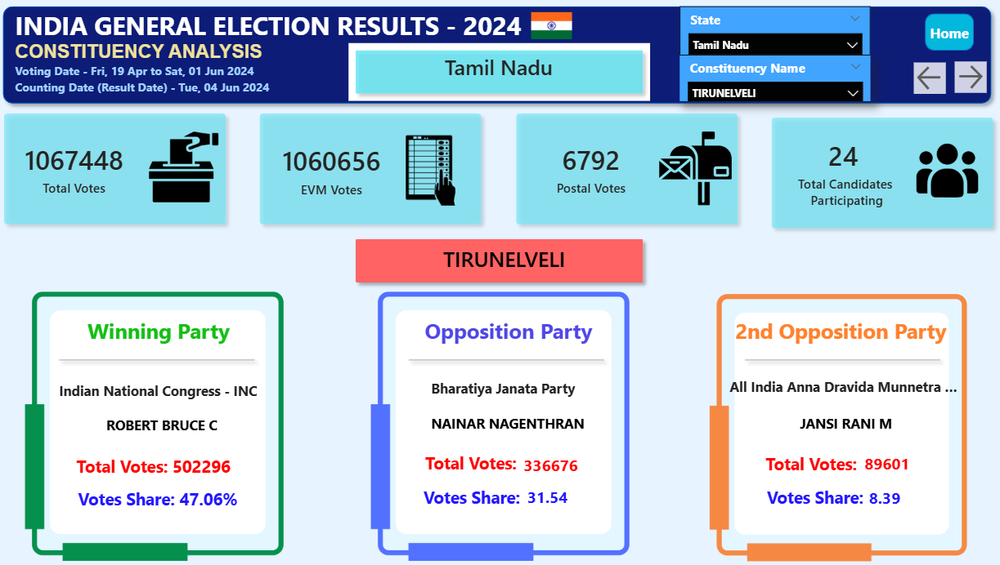
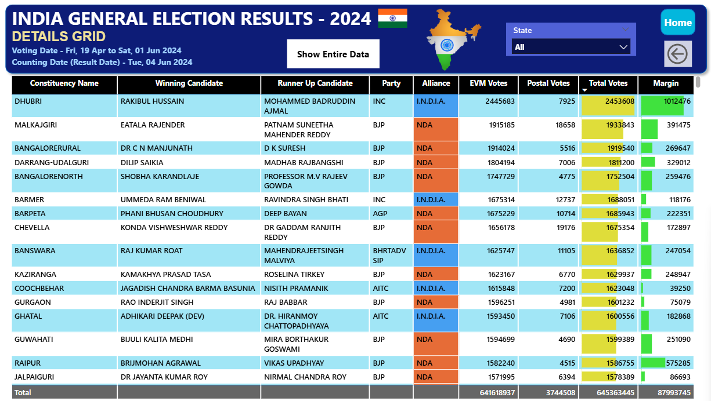

# 🗳️ 2024 Indian General Election Analysis – Power BI Dashboard  

## 📌 Project Overview  
This project analyzes the **2024 Indian General Election Results** using Power BI.  
It provides alliance-wise, state-wise, and constituency-level insights to understand the political landscape and performance of NDA, I.N.D.I.A., and other parties.  

---

## 🛠️ Tools & Technologies  
- Power BI – Dashboard design & visualization  
- DAX – KPI calculations and measures  
- Excel / SQL – Data preprocessing  
- Data Modeling & Visualization  

---

## 🖼️ Dashboard Preview 
### 🔹 Home Dashboards
  

### 🔹 Overview Dashboard  
  

### 🔹 Political Landscape by State 
 

### 🔹 State Analysis  
  
  

### 🔹 Constituency Analysis  
  

### 🔹 Detail Grid
  

---

## 🖼️ Dashboard
![Dashboard]

## 📊 Dashboards & Key Insights  

- **Overview Analysis**: Seats won by NDA, I.N.D.I.A., and others with percentage share  
- **State Demographic Analysis**: State-wise seat distribution, majority alliance, and winning candidates  
- **Political Landscape by State**: Party-wise seat share and comparative analysis  
- **Constituency Analysis**: Winning candidate, runner-up, vote share, and margin of victory  
- **Detailed Grid**: Tabular breakdown with drill-through and export options  

---
